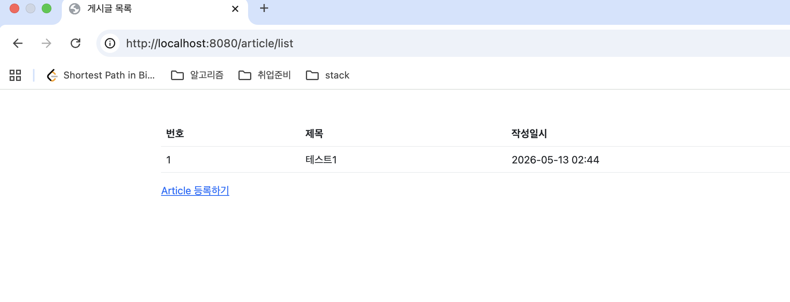
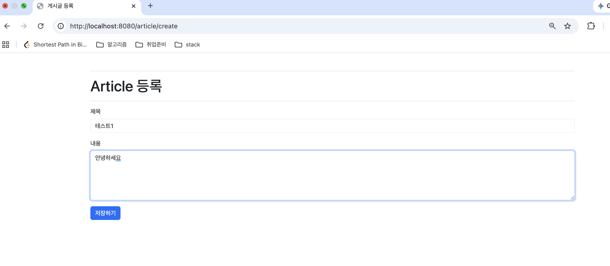
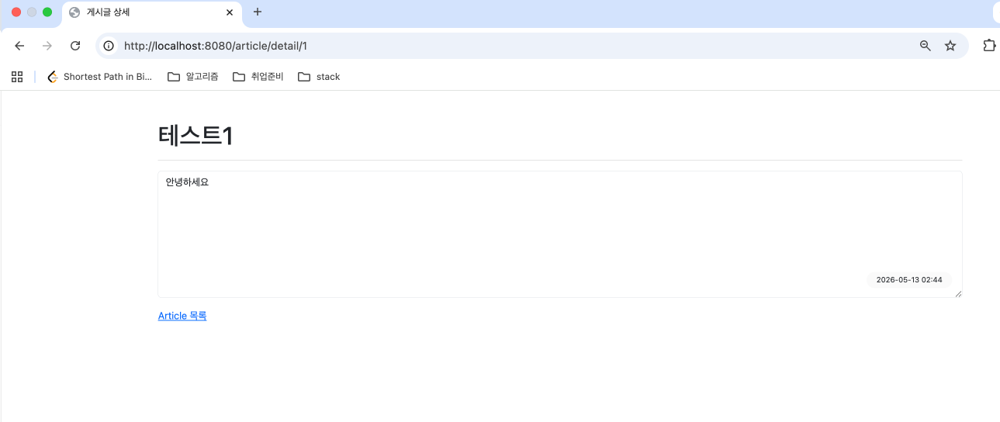

## 1차 요구사항 구현
- [ x] 유저가 루트 url로 접속시에 게시글 리스트 페이지(http://주소:포트/article/list)가 나온다.
- [ x] 리스트 페이지에서는 등록 버튼이 있고 버튼을 누르면 http://주소:포트/article/create 경로로 이동하고 등록 폼이 나온다.
- [ x] 게시글 등록을 하면 http://주소:포트/article/create로 POST 요청을 보내어 DB에 해당 내용을 저장한다.
- [ x] 게시글 등록이 되면 해당 게시글 리스트 페이지로 리다이렉트 된다. 페이지 URL 은 http://주소:포트/article/list 이다.
- [ x] 리스트 페이지에서 해당 게시글을 클릭하면 상세페이지로 이동한다. 해당 경로는 http://주소:포트/article/detail/{id} 가 된다.
- [ x] 게시글 상세 페이지에는 id에 맞는 게시글 데이터와 목록 버튼이 있다. 목록 버튼을 누르면 게시글 리스트 페이지로 이동하게 된다.

- [ x] 게시글 등록 폼 페이지에서 제목과 내용이 입력되지 않으면 등록이 되지 않고 에러 메시지가 나온다.

## 미비사항 or 막힌 부분
- ...

## UI/UX (화면 캡처본을 복사 붙여 넣기, url 주소 나오도록)

- 게시글 리스트 페이지

- 게시글 등록 폼 페이지

- 게시글 상세 페이지

## MVC 패턴
- Model
    - 데이터와 비즈니스 로직을 담당한다.
    - Article Entity, Repository, Service 등이 포함된다.

- View
    - 사용자에게 보여지는 화면을 담당한다.
    - Thymeleaf 기반 HTML 템플릿을 사용하였다.

- Controller
    - 사용자의 요청을 처리하고 적절한 View를 반환한다.
    - URL 요청과 Service를 연결하는 역할을 수행한다.

## 스프링에서 의존성 주입(DI) 방법 3가지 방법

### 1. 생성자 주입
- 생성자를 통해 객체를 주입받는 방식이다.
- final 사용이 가능하며 가장 권장되는 방식이다.
- Lombok의 @RequiredArgsConstructor와 함께 자주 사용된다.

### 2. 필드 주입
- @Autowired를 필드에 직접 사용하는 방식이다.
- 코드가 간단하지만 테스트와 유지보수에 불리하다.

### 3. Setter 주입
- Setter 메서드를 통해 의존성을 주입받는 방식이다.
- 선택적 의존성 주입에 사용될 수 있다.

## JPA의 장점과 단점

### 장점
- SQL을 직접 작성하지 않아도 된다.
- 객체 중심 개발이 가능하다.
- 생산성과 유지보수성이 높다.
- 데이터베이스 변경에 유연하게 대응할 수 있다.

### 단점
- 복잡한 쿼리에서는 성능 문제가 발생할 수 있다.
- 학습 난이도가 존재한다.
- 내부 동작을 이해하지 못하면 예상치 못한 문제가 발생할 수 있다.

## HTTP GET 요청과 POST 요청의 차이

### GET
- 데이터를 조회할 때 사용하는 요청 방식이다.
- 데이터가 URL에 노출된다.
- 브라우저 캐싱이 가능하다.

### POST
- 데이터를 저장하거나 수정할 때 사용하는 요청 방식이다.
- 데이터가 Body에 담겨 전달된다.
- URL에 데이터가 노출되지 않는다.