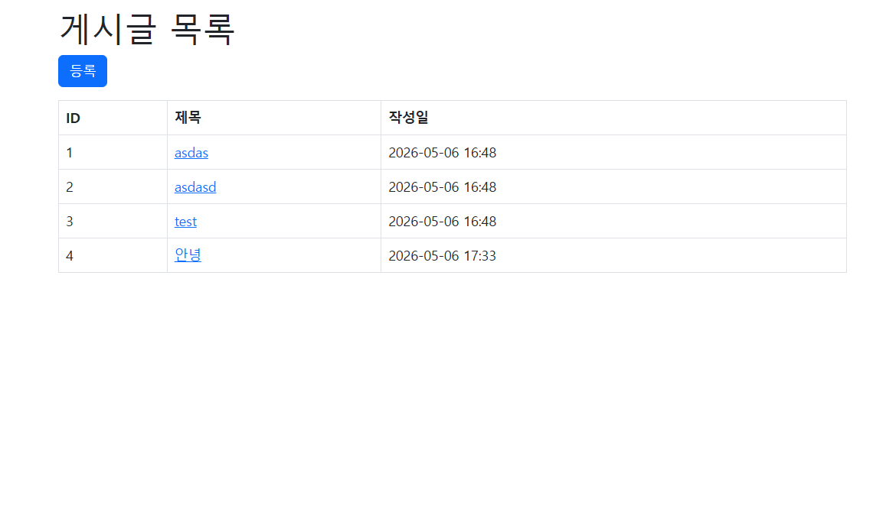

## 1차 요구사항 구현
- [x] 유저가 루트 url로 접속시에 게시글 리스트 페이지(http://주소:포트/article/list)가 나온다.
- [x] 리스트 페이지에서는 등록 버튼이 있고 버튼을 누르면 http://주소:포트/article/create 경로로 이동하고 등록 폼이 나온다.
- [x] 게시글 등록을 하면 http://주소:포트/article/create로 POST 요청을 보내어 DB에 해당 내용을 저장한다.
- [x] 게시글 등록이 되면 해당 게시글 리스트 페이지로 리다이렉트 된다. 페이지 URL 은 http://주소:포트/article/list 이다.
- [x] 리스트 페이지에서 해당 게시글을 클릭하면 상세페이지로 이동한다. 해당 경로는 http://주소:포트/article/detail/{id} 가 된다.
- [x] 게시글 상세 페이지에는 id에 맞는 게시글 데이터와 목록 버튼이 있다. 목록 버튼을 누르면 게시글 리스트 페이지로 이동하게 된다.

### 추가 구현 사항
- Thymeleaf Layout Dialect를 활용하여 공통 레이아웃(`layout.html`)을 분리, 각 페이지가 이를 상속하는 템플릿 구조 적용
- Bootstrap 5를 적용하여 기본적인 UI 스타일링 구현
- 게시글 등록일시(`createdDate`)를 `yyyy-MM-dd HH:mm` 형식으로 포맷하여 목록 및 상세 페이지에 표시
- 게시글 상세 페이지에서 본문 내 줄바꿈이 그대로 표시되도록 `white-space: pre-line` CSS 적용

## 미비사항 or 막힌 부분
- 게시글 수정/삭제 기능은 이번 요구사항에 포함되지 않아 미구현
- 입력값 유효성 검사(제목/내용 필수 입력 등) 미적용
- 페이지네이션 미적용 (게시글이 많아질 경우 목록 페이지에 전체 데이터가 노출됨)

## UI/UX (화면 캡처본을 복사 붙여 넣기, url 주소 나오도록)
- 게시글 리스트 페이지


- 게시글 등록 폼 페이지


- 게시글 상세 페이지


## MVC 패턴

MVC(Model-View-Controller)는 애플리케이션을 세 가지 역할로 분리하여 관심사를 나누는 소프트웨어 설계 패턴이다.

| 계층 | 역할 | 본 프로젝트 해당 파일 |
|---|---|---|
| **Model** | 데이터와 비즈니스 로직을 담당 | `Article.java`, `ArticleService.java`, `ArticleRepository.java` |
| **View** | 사용자에게 보여지는 화면을 담당 | `article_list.html`, `article_create.html`, `article_detail.html` |
| **Controller** | 사용자 요청을 받아 Model과 View를 연결 | `ArticleController.java`, `MainController.java` |

**흐름 예시 (게시글 목록 조회)**
```
사용자 브라우저 → GET /article/list
  → ArticleController (요청 수신)
  → ArticleService.getList() (비즈니스 로직)
  → ArticleRepository.findAll() (DB 조회)
  → Article 데이터 반환
  → article_list.html 렌더링 후 응답
```

MVC 패턴을 사용하면 각 계층의 역할이 명확히 분리되어 유지보수와 코드 재사용이 용이해진다.

## 스프링에서 의존성 주입(DI) 방법 3가지

DI(Dependency Injection)란 객체가 필요로 하는 의존 객체를 직접 생성하지 않고 외부(Spring 컨테이너)로부터 주입받는 방식이다.

### 1. 생성자 주입 (Constructor Injection)
```java
@Service
@RequiredArgsConstructor
public class ArticleService {
    private final ArticleRepository articleRepository; // final 선언 후 생성자로 주입
}
```
- 의존성이 `final`로 선언되어 불변성이 보장됨
- 테스트 시 Mock 객체 주입이 쉬움
- 순환 의존성을 컴파일 시점에 감지 가능
- **스프링 공식 권장 방식** (Lombok의 `@RequiredArgsConstructor`와 함께 자주 사용)

### 2. 필드 주입 (Field Injection)
```java
@Service
public class ArticleService {
    @Autowired
    private ArticleRepository articleRepository;
}
```
- 코드가 간결하지만 `final` 선언 불가로 불변성 보장 안 됨
- 테스트 시 주입이 어렵고 순환 의존성 문제를 런타임에서야 발견
- 현재는 지양하는 방식

### 3. 세터 주입 (Setter Injection)
```java
@Service
public class ArticleService {
    private ArticleRepository articleRepository;

    @Autowired
    public void setArticleRepository(ArticleRepository articleRepository) {
        this.articleRepository = articleRepository;
    }
}
```
- 선택적 의존성(optional dependency)에 적합
- 의존성이 변경 가능해 불변성 보장 안 됨
- 주입 누락 시 런타임 오류 발생 가능

> **본 프로젝트**에서는 `@RequiredArgsConstructor`를 사용한 **생성자 주입** 방식을 채택하였다.

## JPA의 장점과 단점

JPA(Java Persistence API)는 자바 표준 ORM(Object-Relational Mapping) 명세로, 객체와 관계형 데이터베이스 테이블을 매핑해준다.

### 장점
| 항목 | 설명 |
|---|---|
| **생산성 향상** | SQL을 직접 작성하지 않아도 `save()`, `findAll()`, `findById()` 등의 메서드로 DB 작업 가능 |
| **객체 중심 개발** | 테이블이 아닌 Java 객체(Entity) 중심으로 개발할 수 있어 코드 가독성 향상 |
| **DB 독립성** | 특정 DB에 종속되지 않아 MySQL, PostgreSQL 등 교체가 용이 |
| **유지보수 용이** | 컬럼 변경 시 Entity 클래스만 수정하면 SQL 쿼리 수정 불필요 |
| **자동 스키마 관리** | `ddl-auto` 설정으로 테이블 자동 생성/변경 가능 |

### 단점
| 항목 | 설명 |
|---|---|
| **학습 곡선** | ORM 개념, 영속성 컨텍스트, 지연 로딩 등 이해해야 할 개념이 많음 |
| **복잡한 쿼리의 한계** | 다중 조인, 집계 함수 등 복잡한 쿼리는 JPQL이나 네이티브 쿼리를 별도로 작성해야 함 |
| **성능 이슈** | N+1 문제 등 ORM이 생성하는 쿼리가 비효율적일 수 있어 튜닝이 필요한 경우 있음 |
| **디버깅 어려움** | 자동 생성된 SQL을 추적하기 어려울 수 있어 `show-sql: true` 등의 설정이 필요 |

## HTTP GET 요청과 POST 요청의 차이

| 구분 | GET | POST |
|---|---|---|
| **목적** | 서버에서 데이터를 **조회**할 때 사용 | 서버에 데이터를 **전송/저장**할 때 사용 |
| **데이터 전달 방식** | URL 쿼리스트링에 포함 (`?key=value`) | HTTP 요청 Body에 포함 |
| **데이터 노출** | URL에 노출되어 브라우저 히스토리, 서버 로그에 남음 | Body에 담겨 URL에 노출되지 않음 |
| **데이터 크기 제한** | URL 길이 제한으로 대용량 전송 불가 | 제한 없이 대용량 데이터 전송 가능 |
| **멱등성** | 동일 요청을 반복해도 결과가 같음 (멱등) | 반복 요청 시 데이터가 중복 생성될 수 있음 (비멱등) |
| **캐싱** | 캐싱 가능 | 캐싱 불가 |
| **본 프로젝트 사용 예시** | `GET /article/list` (목록 조회), `GET /article/detail/{id}` (상세 조회) | `POST /article/create` (게시글 저장) |
