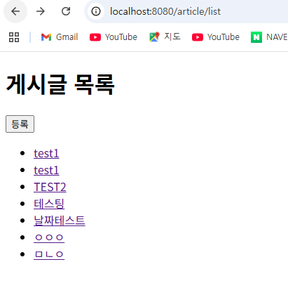
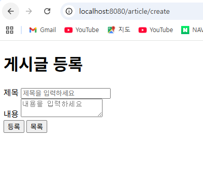
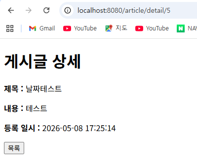

## 1차 요구사항 구현
- [o] 유저가 루트 url로 접속시에 게시글 리스트 페이지(http://주소:포트/article/list)가 나온다.
- [o] 리스트 페이지에서는 등록 버튼이 있고 버튼을 누르면 http://주소:포트/article/create 경로로 이동하고 등록 폼이 나온다.
- [o] 게시글 등록을 하면 http://주소:포트/article/create로 POST 요청을 보내어 DB에 해당 내용을 저장한다.
- [o] 게시글 등록이 되면 해당 게시글 리스트 페이지로 리다이렉트 된다. 페이지 URL 은 http://주소:포트/article/list 이다.
- [o] 리스트 페이지에서 해당 게시글을 클릭하면 상세페이지로 이동한다. 해당 경로는 http://주소:포트/article/detail/{id} 가 된다.
- [o] 게시글 상세 페이지에는 id에 맞는 게시글 데이터와 목록 버튼이 있다. 목록 버튼을 누르면 게시글 리스트 페이지로 이동하게 된다.

- (추가 기능이나 구현기능설명이 필요한 경우 서술)

## 미비사항 or 막힌 부분
- 게시글 등록 폼 구현 시 `<form>` 태그의 `action`과 `method` 속성을 올바르게 설정하는 부분에서 어려움이 있었습니다.
- GET과 POST 요청의 차이를 이해하고, 등록 폼에서는 `method="post"`를 사용해야 DB에 데이터가 저장된다는 것을 파악하는 데 시간이 걸렸습니다.

## UI/UX (화면 캡처본을 복사 붙여 넣기, url 주소 나오도록)
- 게시글 리스트 페이지

- 게시글 등록 폼 페이지

- 게시글 상세 페이지

## MVC 패턴
- ArticleController는 사용자의 요청을 받아 적절한 응답을 반환하는 Controller 역할을 담당
- Article은 DB 테이블과 매핑되는 Model 역할을 담당
- list.html, create.html, detail.html은 사용자에게 화면을 보여주는 View 역할을 담당
- Controller는 요청/응답만 처리하고 비즈니스 로직은 ArticleService에 위임함으로써 역할을 명확하게 분리했습니다.

## 스프링에서 의존성 주입(DI) 방법 3가지 방법
- 생성자 주입
    - 생성자를 통해 의존 객체를 주입받는 방식으로 스프링에서 가장 권장하는 방식.
- 필드 주입
    - `@Autowired`를 필드에 직접 붙이는 방식으로 코드가 간결하지만 테스트가 어려움.
- Setter 주입
    - Setter 메서드를 통해 의존 객체를 주입받는 방식으로 선택적 의존성에 사용.

## JPA의 장점과 단점
- 장점
    - SQL을 직접 작성하지 않아도 save(), findAll(), findById() 같은 메서드로 DB를 다룰 수 있어 생산성이 높습니다.
    - 특정 DB에 종속되지 않아 MySQL, Oracle 등 DB를 교체해도 코드 변경이 거의 없습니다.
- 단점
    - 복잡한 쿼리를 작성할 때 JPQL이나 Native Query를 사용해야 하며, 이 경우 SQL을 직접 작성해야 하는 상황이 발생할 수 있습니다.
    - JPA의 추상화로 인해 성능 최적화가 어려울 수 있으며, 대량의 데이터를 처리할 때는 주의가 필요합니다.

## HTTP GET 요청과 POST 요청의 차이
- GET 요청
  데이터를 조회할 때 사용합니다. 이번 프로젝트에서 게시글 리스트 페이지(/article/list)나 상세 페이지(/article/detail/{id})에 접근할 때 사용했습니다.
- POST 요청
  데이터를 생성하거나 변경할 때 사용합니다. 이번 프로젝트에서 게시글 등록(/article/create) 시 사용했습니다.
