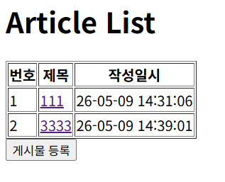
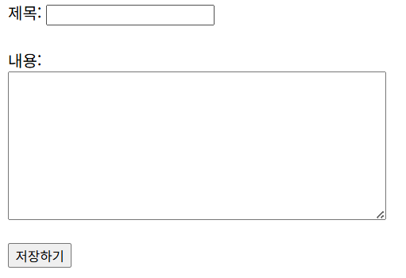
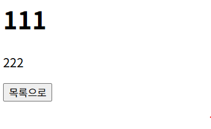

## 1차 요구사항 구현
- [x] 유저가 루트 url로 접속시에 게시글 리스트 페이지(http://주소:포트/article/list)가 나온다.
- [X] 리스트 페이지에서는 등록 버튼이 있고 버튼을 누르면 http://주소:포트/article/create 경로로 이동하고 등록 폼이 나온다.
- [x] 게시글 등록을 하면 http://주소:포트/article/create로 POST 요청을 보내어 DB에 해당 내용을 저장한다.
- [x] 게시글 등록이 되면 해당 게시글 리스트 페이지로 리다이렉트 된다. 페이지 URL 은 http://주소:포트/article/list 이다.
- [x] 리스트 페이지에서 해당 게시글을 클릭하면 상세페이지로 이동한다. 해당 경로는 http://주소:포트/article/detail/{id} 가 된다.
- [z] 게시글 상세 페이지에는 id에 맞는 게시글 데이터와 목록 버튼이 있다. 목록 버튼을 누르면 게시글 리스트 페이지로 이동하게 된다.

- (추가 기능이나 구현기능설명이 필요한 경우 서술)

## 미비사항 or 막힌 부분

- 전체적으로 막혔었습니다.
  - 해결방안 : 반복학습 필수적으로 진행하겠습니다.
        

## UI/UX (화면 캡처본을 복사 붙여 넣기, url 주소 나오도록)
- 게시글 리스트 페이지 
- 게시글 등록 폼 페이지 
- 게시글 상세 페이지 

## MVC 패턴
* MVC 패턴은 Model-View-Controller의 약자로, 소프트웨어 디자인 패턴이다.
* 애플리케이션을 세 가지 주요 구성 요소로 나눈다.
  * Model
    * 데이터와 비즈니스 로직을 담당하는 객체
    * 상태변화를 처리하며 뷰나 컨트롤러에 종속되지 않음
  * View
    * 데이터를 시각화하여 사용자의 화면에 보여주는 역할
    * 모델로부터 전달받은 데이터를 출력하며 내부에는 비지니스 로직을 포함하지 않는다.
  * Controller
    * 사용자의 요청을 해석하고 처리의 흐름을 제어
    * 모델의 비지니스 로직을 호출하고 결과를 뷰에 전달하는 중계자 역할 수행
    * 다른 컴포넌트들의 존재를 알고 있는 유일한 계층
* ServiceLayer : 엔티티 간의 관계관리 및 어플리케이션의 흐름제어, 트랜잭션 관리, 비즈니스 로직을 담당하는 계층
* RepositoryLayer : 데이터베이스와의 상호작용을 담당하는 계층, 데이터의 저장, 조회, 삭제 등의 작업을 수행
## 스프링에서 의존성 주입(DI) 방법 3가지 방법
- 생성자 주입(Constructor Injection)
  - 의존성을 생성자의 매개변수로 전달하는 방법
  - 장점 : 불변성 보장, 테스트 용이, 순환 의존성 방지
  - 단점 : 코드가 길어질 수 있음(해결방안 : Lombok의 @RequiredArgsConstructor 사용)
- 세터 주입(Setter Injection)
  - 의존성을 세터 메서드를 통해 주입하는 방법
  - 장점 : 선택적 의존성 주입 가능, 코드가 간결해질 수 있음
  - 단점 : 불변성 보장 어려움, 순환 의존성 방지 어려움
- 필드 주입(Field Injection)
  - 의존성을 필드에 직접 주입하는 방법
  - 장점 : 코드가 간결해질 수 있음
  - 단점 : 불변성 보장 어려움, 테스트 용이성 저하, 순환 의존성 방지 어려움

## JPA의 장점과 단점
* **JPA** : Java Persistence API의 약자로, 자바에서 객체와 관계형 데이터베이스 간의 매핑을 관리하는 표준 인터페이스
  * 장점 
    * 생산성 향상 : 개발자가 SQL 쿼리를 직접 작성하지 않고도 데이터베이스 작업을 수행할 수 있어 개발 속도가 빨라짐
    * 객체 지향적 접근 : 데이터베이스의 테이블과 객체를 매핑하여 객체 지향적으로 데이터를 다룰 수 있음
    * 데이터베이스 독립성 : JPA는 다양한 데이터베이스를 지원하므로, 특정 데이터베이스에 종속되지 않고 애플리케이션을 개발할 수 있음
    * 캐싱 및 성능 최적화 : JPA는 1차 캐시와 2차 캐시를 제공하여 데이터베이스 접근을 최적화하고 성능을 향상시킬 수 있음
  * 단점
    * 학습 곡선 : JPA는 복잡한 개념과 다양한 기능을 가지고 있어, 초보자에게는 학습 곡선이 가파를 수 있음
    * 복잡한 쿼리 작성 어려움 : 복잡한 쿼리를 작성하는 경우, JPQL이나 Criteria API를 사용해야 하며, 이는 SQL에 비해 직관적이지 않을 수 있음

## HTTP GET 요청과 POST 요청의 차이
| HTTP GET 요청 | HTTP POST 요청 |
| --- | --- |
| 데이터를 URL에 포함하여 전송 | 데이터를 요청 본문에 포함하여 전송 |
| 주로 데이터를 조회할 때 사용 | 주로 데이터를 생성하거나 업데이트할 때 사용 |
| 캐싱 가능 | 캐싱 불가능 |
| 즐겨찾기 가능 | 즐겨찾기 불가능 | 
```